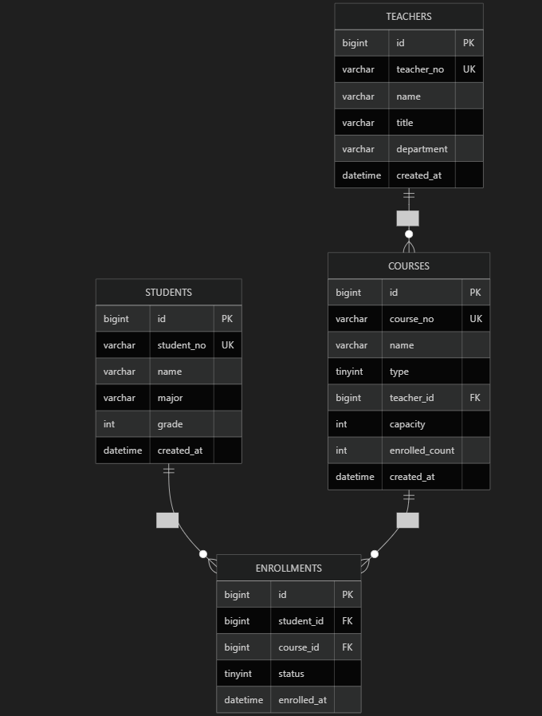

# 选课系统
Spring Boot 3.2.5 + Java 17
采用claude code AI辅助开发工具

本地前端简易测试url:http://localhost:8080/index.html

提示词：

    step1:
        你现在是一个资深的 Java 后端开发工程师和 DBA。请帮我完成以下两项任务：
        任务一：Java 基础算法实现（高校选课管理系统 - 学生选课基础处理工具）
        我有一个选课记录实体类 `EnrollRecord`，包含 `studentId`、`courseId`、`courseName`，并重写了 `toString`。
        请你编写一个工具类 `EnrollmentProcessor`，包含一个静态方法 `processEnrollments(List<EnrollRecord> records)`，实现以下功能：
        1. 去重：学生ID + 课程ID 完全一致视为重复记录，直接移除（只保留一条即可，与课程名称无关）。
        2. 排序：先按学生ID升序，相同时按课程ID升序。
        3. 输出与返回：在控制台逐行打印格式化信息（直接调用 toString），并返回处理后的列表。
           要求：使用 Java 8+ 的 Stream API 优雅实现，代码需包含必要的注释，并提供一个带有测试数据的 `main` 方法进行验证。
        任务二：SQL 编程
        基于 `enrollments` 表（student_id, course_id, enroll_time）和 `courses` 表（course_id, course_name, course_type, capacity），编写两道 SQL：
        1. 统计每门课程的选课人数：返回课程ID、课程名称、选课人数（别名：enroll_count），按选课人数降序排序。
        2. 统计选课人数超过50人的专业课：返回课程ID、课程名称、选课人数，按选课人数升序排序。
        要求：直接给出标准 SQL 语句。

    step2:
        你现在是一位熟悉 Spring Boot 3.x 的全栈开发工程师。请帮我开发一个基于 Spring Boot 3.x 的选课管理系统简易版本。
        具体要求如下：
        1. 架构规范：
           - 使用 Spring Boot 3.x（JDK 17）。
           - 严格遵循 Controller -> Service -> 实体层架构，业务逻辑必须在 Service 层。
           - 前端使用 HTML + 原生 JS（可通过 Fetch API 与后端交互），不使用任何复杂前端框架（如 Vue/React），保持简单可用。
           2. 实体类扩展：
           - 在之前 `EnrollRecord` 的基础上，增加 `courseType`（课程类型：公共课、专业课、选修课）字段。
           3. 后端功能（Service 层）：
           - 批量处理与去重排序：接收批量传入的选课数据，执行去重（学生ID+课程ID）和排序（学生ID升序，课程ID升序）。
           - 选课分类：支持按课程类型分类存储和返回数据。
           - 检索功能：支持按学生ID、课程ID、课程名称、课程类型模糊或精确检索，无匹配时抛出自定义异常或返回特定提示。
           - 性能考量：考虑到 1000 条以上记录，数据在内存中处理需使用高效的集合操作。
           4. 接口设计（Controller 层）：
           - POST `/api/enrollments/import`：接收前端传来的 CSV 格式文本（多行字符串），解析成 List<EnrollRecord> 并交由 Service 处理，返回处理后的分类数据。
           - GET `/api/enrollments/search`：接收查询关键字，返回检索结果。
           5. 前端页面（index.html）：
           - 包含一个文本域（Textarea），用于输入 CSV 格式数据（例如：S000001,C000001,Java程序设计,专业课）。
           - 包含一个“导入处理”按钮，点击后调用后端的 import 接口。
           - 包含一个搜索框和搜索按钮。
           - 下方使用简单的 HTML 表格（Table）展示处理后的结果，可按“课程类型”分组展示。
        请生成所有必需的 Java 文件（包括启动类、Controller、Service、DTO实体类）以及前端 `index.html` 的完整代码。并在代码末尾，说明这套代码是如何满足 1000 条数据响应 <= 1秒的性能要求的。

入参格式正则严格校验（适配选课场景）：在后端的 CSV 解析逻辑（`EnrollmentService.parseCsv`）中，后续引入了针对学号（`S\d{6}`）和课程号（`C\d{6}`）的正则表达式拦截。
  
修改原因：AI生成的代码缺乏对业务边界的校验。增加此校验，能在不抛出阻断异常的前提下，自动过滤脏数据，保障底层统计与关联的准确性。

搜索框回车事件绑定（优化页面交互）：在前端 `app.js` 中补充了对输入框 `keydown` 事件的监听逻辑。
   
修改原因：AI仅实现了基础的按钮点击搜索，后续通过增加回车触发机制（`e.key === 'Enter'`），提升用户的交互体验。

# 简易优化思路
实体扩展： 补充了 TEACHERS（教师表），并在 COURSES（课程表）中冗余了 enrolled_count（已选人数）字段，为后续高并发扣减提供支撑。
关联关系：

1对N： 教师与课程（TEACHERS -> COURSES），一名教师可挂载多门课程。

M对N： 学生与课程（STUDENTS <-> COURSES）属于典型的多对多关系。本架构通过建立 ENROLLMENTS（选课记录表）作为中间表，将多对多拆解为两个1对N关系，逻辑清晰且易于扩展。

完善数据架构的ER图如下：

并发风险分析与解决方案
  
 核心风险：“并发超卖”

 在抢课高峰期（如50人容量的热门课），大量并发请求若先`SELECT`判断容量，再`INSERT`记录，极易因非原子操作导致实际选上的人数超过50人。

简单可行的解决方案：

考虑到系统规模，不引入Redis等复杂中间件，以MySQL底层的行排他锁机制，通过一条原子 SQL 完成校验与扣减：

UPDATE COURSES
SET enrolled_count = enrolled_count + 1
WHERE id = #{courseId}
AND enrolled_count < capacity;

索引设计：

ENROLLMENTS（选课记录表）：

联合索引 (student_id, course_id)： 防重，确保在高并发或前端重复点击的情况下，同一学生不会对同一门课产生重复记录。

普通索引 (course_id)： 加速“统计每门课程选课人数”等基于课程查询。

